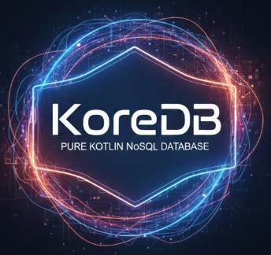

# KoreDB 🚀

<p align="center">
  
  <br>
  <b>The AI-Native, High-Performance NoSQL Database for Modern Android.</b>
</p>

KoreDB is a pure Kotlin, embedded database engine built from the ground up using a **Log-Structured Merge-tree (LSM)** architecture. Unlike SQLite (designed for spinning disks in 2000), KoreDB is optimized for modern flash storage, high-concurrency Coroutines, and on-device AI applications.

---

## ✨ Features

*   **⚡ Blazing Performance:** LSM architecture offers $O(1)$ write performance.
*   **🤖 AI-Native Vector Store:** Built-in high-performance vector similarity search using Cosine Similarity, optimized with SIMD-like loop unrolling.
*   **🏗️ Pure Kotlin:** 100% Kotlin with Zero JNI overhead. No more `sqlite3.so` bloat.
*   **🔗 Coroutine First:** Built for non-blocking I/O and reactive UI with `Flow`.
*   **🛡️ Crash Resilient:** Write-Ahead Logging (WAL) ensures your data survives process death or system crashes.
*   **🔍 Optimized Reads:** Bloom Filters and Sparse Indexing ensure fast lookups by avoiding unnecessary disk I/O.
*   **📦 Lightweight:** Minimal footprint, perfect for mobile apps.

---

## 🚀 Quick Start

### 1. Installation

Add the dependency to your `build.gradle.kts`:

```kotlin
dependencies {
    implementation("io.github.raipankaj:koredb:0.0.1")
}
```

### 2. Setup Serialization (Recommended)

KoreDB uses **Kotlinx Serialization** to handle Data Classes. To use the built-in `collection<T>` API, add the serialization plugin to your project:

**Project `build.gradle.kts`:**
```kotlin
plugins {
    kotlin("plugin.serialization") version "2.0.21" 
}
```

**Module `build.gradle.kts`:**
```kotlin
plugins {
    kotlin("plugin.serialization")
}

dependencies {
    implementation("org.jetbrains.kotlinx:kotlinx-serialization-json:1.8.0")
}
```

> **Note:** Kotlinx Serialization is optional. If you prefer Moshi or Gson, you can implement the `KoreSerializer<T>` interface and pass it to the collection manually.

### 3. Initialize Database

Initialize KoreDB once in your `Application` class:

```kotlin
class MyApplication : Application() {
    lateinit var database: KoreDatabase

    override fun onCreate() {
        super.onCreate()
        // Initializes the engine in the app's secure internal storage
        database = KoreAndroid.create(this, "my_notes_db")
    }
}
```

---

## 🛠️ Supported Operations

### 📦 Typed Collections
Manage your data classes with ease using `KoreCollection<T>`.

| Operation | Description |
| :--- | :--- |
| `insert(id, doc)` | Inserts or updates a document. |
| `insertBatch(map)` | Efficiently saves multiple documents in one transaction. |
| `getById(id)` | Retrieves a document by its unique ID. |
| `getAll()` | Retrieves all documents in the collection. |
| `delete(id)` | Deletes a document (uses $O(1)$ Tombstones). |
| `deleteAll()` | Clears the entire collection. |
| `observeById(id)` | Returns a `Flow<T?>` that emits updates for a specific record. |
| `observeAll()` | Returns a `Flow<List<T>>` that emits whenever the collection changes. |
| `createIndex(name, extractor)` | Registers a secondary index for fast querying. |
| `getByIndex(name, value)` | Queries documents using a secondary index. |

### 🤖 AI Vector Collections
Store and search high-dimensional embeddings with `KoreVectorCollection`.

| Operation | Description |
| :--- | :--- |
| `insert(id, floatArray)` | Saves a vector embedding. |
| `insertBatch(map)` | Batch inserts multiple vectors. |
| `search(query, limit)` | Performs Cosine Similarity search and returns top-K results. |

---

## 💡 Usage Examples

### Basic CRUD & Observation
```kotlin
@Serializable
data class Note(val id: String, val title: String, val content: String)

val notes = database.collection<Note>("notes")

// Insert
notes.insert("1", Note("1", "Hello", "KoreDB is fast!"))

// Observe
notes.observeById("1").collect { note ->
    println("Note updated: $note")
}
```

### AI Vector Similarity Search
```kotlin
val vectors = database.vectorCollection("embeddings")

// Search for top 5 similar items
val results = vectors.search(queryVector = floatArrayOf(0.1f, 0.5f, 0.9f), limit = 5)

results.forEach { (id, score) ->
    println("Found $id with similarity score: $score")
}
```

---

## 🛠️ Architecture & Data Lifecycle

KoreDB follows the classic LSM-Tree pattern used by industrial databases like **Bigtable**, **Cassandra**, and **RocksDB**.

### 📝 The Write Path ($O(1)$ Complexity)
When you save data, KoreDB performs two actions simultaneously:
1.  **CommitLog (WAL):** Appends the change to a sequential log on disk. This is extremely fast and ensures your data isn't lost if the app crashes.
2.  **MemTable:** Updates an in-memory sorted tree. Your write is now "complete" and available for reading instantly.

### 📖 The Read Path (Multi-Tiered Lookup)
To find a record, KoreDB searches in this order:
1.  **MemTable:** Check the fastest tier (RAM) first.
2.  **Bloom Filter:** For disk-based files, KoreDB uses a probabilistic filter to check if a key *actually* exists before opening the file, avoiding 99% of unnecessary disk I/O.
3.  **SSTables (Disk):** If found in the filter, it performs a binary search on the disk file using a **Sparse Index** to locate the exact record.

### ♻️ Background Maintenance
*   **Flushing:** Once the MemTable reaches its size limit, it is converted into an immutable **SSTable** and written to disk.
*   **Compaction:** Periodically, KoreDB merges multiple SSTables in the background to remove deleted records (tombstones) and maintain speed.

---

## 📊 KoreDB vs SQLite

| Operation | KoreDB                    | SQLite                   | Winner |
| :--- |:--------------------------|:-------------------------| :--- |
| **Bulk Write** | ⚡ Fast (Appends)          | 🐢 Slower (Page Updates) | **KoreDB** |
| **Vector Search** | 🔥 Ultra Fast (Zero-copy) | 🐌 Slow (Blob Fetching)  | **KoreDB** |
| **Cold Start** | 🚀 Immediate              | ⏳ Slower (Schema Init)   | **KoreDB** |
| **Concurrency** | 🟢 0ms Read Latency       | 🟡 Lock Contention       | **KoreDB** |

---

## 📜 License

```text
Copyright 2024 KoreDB Authors

Licensed under the Apache License, Version 2.0 (the "License");
you may not use this file except in compliance with the License.
You may obtain a copy of the License at

    http://www.apache.org/licenses/LICENSE-2.0

Unless required by applicable law or agreed to in writing, software
distributed under the License is distributed on an "AS IS" BASIS,
 WITHOUT WARRANTIES OR CONDITIONS OF ANY KIND, either express or implied.
See the License for the specific language governing permissions and
limitations under the License.
```

---

## 🤝 Contributing

We welcome contributions! Please feel free to submit a Pull Request or open an issue on our [GitHub repository](https://github.com/pankajrai/KoreDB).

Made with ❤️ by Pankaj Rai.
